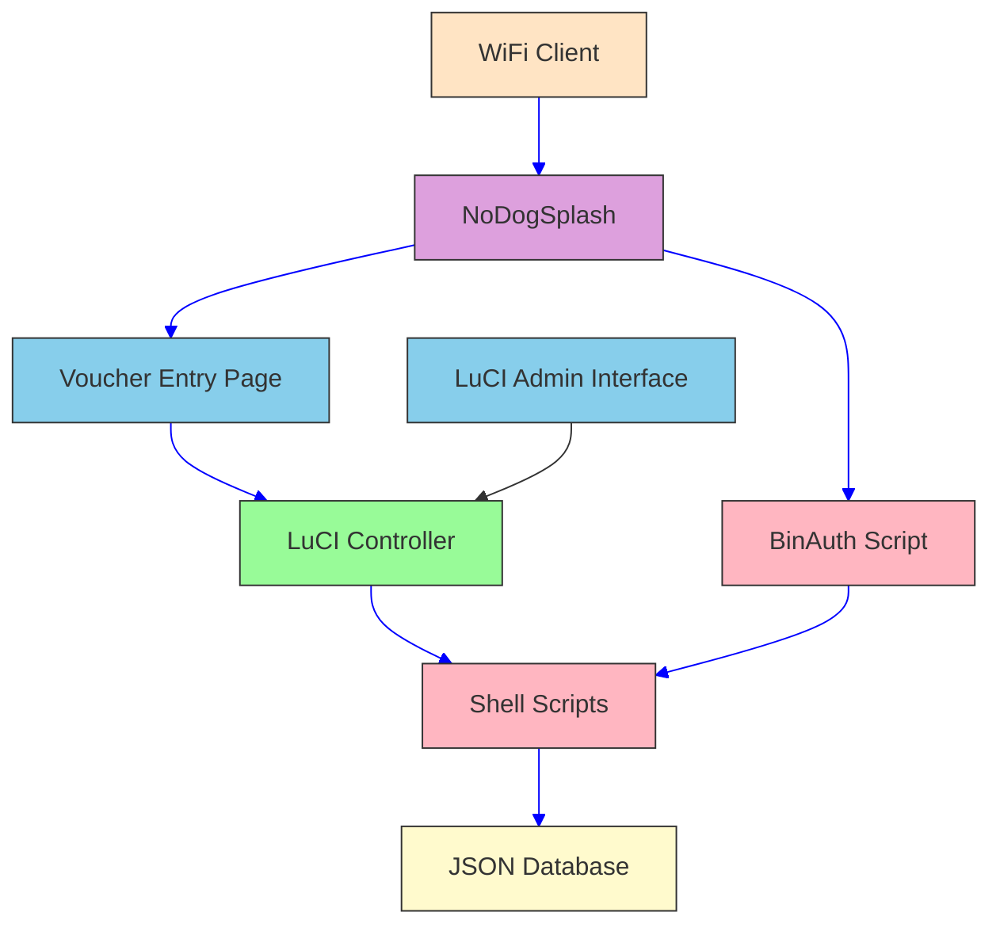

# NDS Voucher System Architecture

## Overview

This diagram shows the architecture of the NDS Voucher System implemented as a LuCI app for OpenWrt routers.

## Components

### 1. WiFi Client
The end user connecting to the WiFi network.

### 2. NoDogSplash
The captive portal software that intercepts unauthenticated traffic and redirects users to the voucher entry page.

### 3. Voucher Entry Page
A web page served by the LuCI controller where users enter their voucher codes.

### 4. LuCI Controller
The main component that handles HTTP requests and serves both the admin interface and the public voucher entry page.

### 5. Shell Scripts
Backend scripts that perform all the actual work:
- Voucher management (add, delete, list, validate)
- Authentication
- Database operations

### 6. JSON Database
Simple JSON files that store voucher data and settings:
- `/data/voucher.json` - Stores voucher information
- `/data/settings.json` - Stores configuration settings

### 7. BinAuth Script
A script called by NoDogSplash to authenticate clients after they've entered a valid voucher.

### 8. LuCI Admin Interface
The administrative interface accessible through the LuCI web interface for managing vouchers.

## Data Flow

1. **User Authentication Flow**:
   - WiFi client connects to network
   - NoDogSplash redirects client to voucher entry page
   - User enters voucher code
   - LuCI controller validates voucher via shell scripts
   - If valid, voucher is marked as used and client is redirected to NoDogSplash auth
   - NoDogSplash calls BinAuth script to verify authentication
   - BinAuth script checks JSON database for valid voucher
   - If found, NoDogSplash grants internet access

2. **Admin Management Flow**:
   - Administrator accesses LuCI interface
   - LuCI controller serves admin pages
   - Admin performs actions (add/delete vouchers, change settings)
   - Controller calls shell scripts to modify JSON database